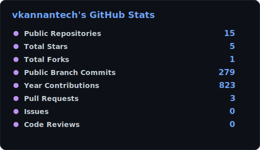
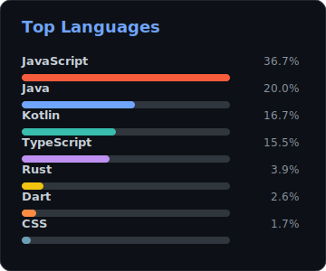
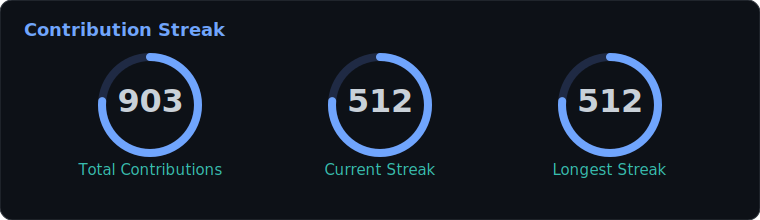
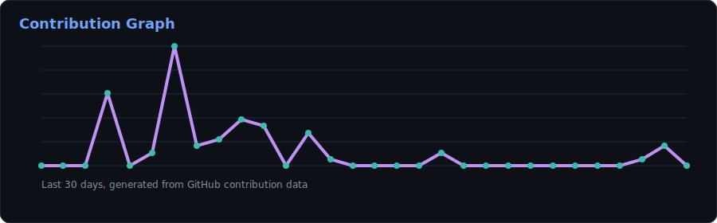
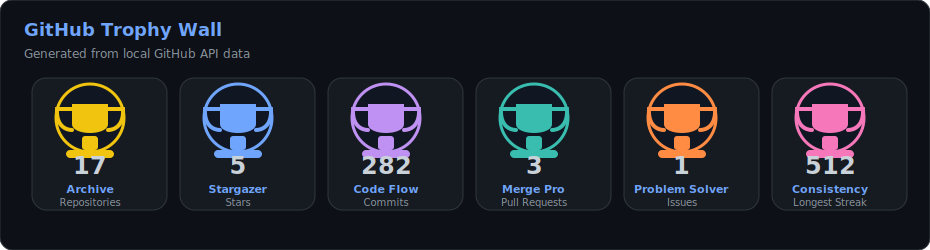

 
 

 

 

<strong>Founder & CEO of <a href="https://www.kannantech.com">KannanTech</a></strong> 
<em>Engineering the future with code - one product, one student, one breakthrough at a time.</em>

---

## About Me

| Identity | Builder Profile |
| --- | --- |
| Name | Venkatesh Perumal Kannan |
| Public Brand | Kannan V / vkannantech |
| Role | Founder & CEO @ KannanTech |
| Focus | AI-first products, full-stack systems, developer education |
| Domains | HealthTech, MusicTech, EdTech, CareerTech, productivity AI |

---

## GitHub Stats

<table>
  <tr>
    <td width="58%" align="center">
      
    </td>
    <td width="42%" align="center">
      
    </td>
  </tr>
</table>

 

 

 

---

## Tech Stack

<table>
  <tr>
    <td width="50%" valign="top">
      <strong>Languages</strong>  
      
      
      
      
      
      
    </td>
    <td width="50%" valign="top">
      <strong>Product Engineering</strong>  
      
      
      
      
      
      
    </td>
  </tr>
  <tr>
    <td width="50%" valign="top">
      <strong>AI & Machine Learning</strong>  
      
      
      
      
      
    </td>
    <td width="50%" valign="top">
      <strong>Cloud, DevOps & Data</strong>  
      
      
      
      
      
      
      
      
      
    </td>
  </tr>
</table>

 

---

## Work Experience

<strong>KannanTech</strong> - Founder & CEO | 2020 - Present | Tamil Nadu, India

 

> `Next.js` `React` `Node.js` `Python` `Java` `AWS` `OpenAI API` `TensorFlow` `Docker` `Supabase` `MySQL`

- Founded and scaled KannanTech into an AI-first technology ecosystem across HealthTech, MusicTech, EdTech, and developer tools.
- Built an MSME-government-certified platform from a YouTube channel into a learning ecosystem with 15,000+ students trained and a 95% job placement rate.
- Architecting autonomous intelligence systems and leading product vision, engineering, delivery, and go-to-market strategy.
- Established 50+ industry partnerships and managed 40+ active intern cohorts with automated tracking and real-time analytics.
- Shipped Internship Hub, AI Resume Architect, FocusFlow AI, Velox Commerce, MediCore, Muzi, and KalviWorld.

<strong>Kalvi World Official</strong> - CEO & Lead Educator | Ongoing | India

 

> `Python` `JavaScript` `React` `Node.js` `TensorFlow` `Mentorship`

- Built a career-guidance and skill-development platform bridging academic learning and industry requirements.
- Produced tutorials across JavaScript, React, Node.js, AI, and cloud computing, reaching learners globally.
- Delivered mentorship, coding challenges, and industry-aligned certification pathways.
- Grew a developer community across YouTube, Telegram, WhatsApp, and Instagram.

---

## Featured Projects

| Project | Stack | Highlights |
| --- | --- | --- |
| [MediCore](https://github.com/vkannantech/MediCore) | Python · TensorFlow · React · MySQL | AI-driven hospital intelligence, autonomous diagnostics, and patient management |
| [Muzi](https://github.com/Muzi-Powered-by-KannanTech/Muzi) | React · Node.js · Next.js | Next-gen music experience engine · v2026.B03.A.05 |
| [KalviWorld](https://github.com/vkannantech/KalviWorld) | React · Java · Docker | Global developer education framework |
| [Internship Hub](https://intern.kannantech.com) | Next.js · Supabase · TypeScript · Tailwind | 40+ cohorts, automated task tracking, verification, and analytics |
| [AI Resume Architect](https://kannantech.com/tools) | OpenAI API · React · Node.js · Stripe | ATS-optimized resumes, profile scoring, and career tooling |
| FocusFlow AI Extension | React · Chrome API · TypeScript · OpenAI | Distraction blocking, focus workflows, and AI summarization |
| Velox Commerce | Next.js · Redis · Stripe Connect · Go | Headless commerce, edge caching, and real-time inventory sync |
| AI Chat System | Python · TensorFlow · NLP · React | Personalized ML responses and AI communication workflows |
| Smart Train Booking | Java · Spring Boot · MySQL · React | QR ticketing, real-time seat availability, and scheduling |

---

## Achievements

| Achievement | Details |
| --- | --- |
| MSME Government Certified | KannanTech certified by Government of India |
| 15,000+ Students Trained | Across KannanTech and Kalvi World |
| 95% Job Placement Rate | Students placed in tech roles |
| 50+ Industry Partners | Network of companies and startups |
| 40+ Active Intern Cohorts | Automated tracking and verification |
| Millions of Tutorial Views | Free tech education worldwide |
| National AI Hackathon 2023 - 1st Place | National-level AI competition |
| AWS Certified Solutions Architect | AWS SAA |
| Google ML Specialization | Machine learning foundations |
| Open Source Contributor | Public GitHub projects and contributions |

---

## Education & Learning Roadmap

| Degree | Institution | Domain |
| --- | --- | --- |
| B.E. / B.Tech - Computer Science | Tamil Nadu, India | Software Engineering & AI |

### Currently Learning

<table>
  <tr>
    <th align="left">Focus Area</th>
    <th align="left">Current Depth</th>
    <th align="left">Applied Direction</th>
  </tr>
  <tr>
    <td><strong>Autonomous AI Agents</strong></td>
    <td>Multi-agent orchestration, ReAct, tool-use workflows</td>
    <td>AI assistants, workflow automation, intelligent product systems</td>
  </tr>
  <tr>
    <td><strong>Advanced LLM Engineering</strong></td>
    <td>Fine-tuning, RAG, LangChain, vector databases</td>
    <td>Domain-aware search, AI resume tools, knowledge platforms</td>
  </tr>
  <tr>
    <td><strong>Computer Vision</strong></td>
    <td>OpenCV, object detection, real-time inference</td>
    <td>Healthcare intelligence, visual automation, inspection systems</td>
  </tr>
  <tr>
    <td><strong>Edge AI</strong></td>
    <td>TensorFlow Lite, ONNX, on-device inference</td>
    <td>Fast local models, low-latency AI, offline-capable products</td>
  </tr>
  <tr>
    <td><strong>Cloud-Native Systems</strong></td>
    <td>Kubernetes, serverless, distributed systems</td>
    <td>Scalable SaaS, reliable deployments, production operations</td>
  </tr>
  <tr>
    <td><strong>System Design</strong></td>
    <td>Microservices, event-driven architecture, CQRS</td>
    <td>High-scale platforms, clean service boundaries, resilient APIs</td>
  </tr>
  <tr>
    <td><strong>AI Product Strategy</strong></td>
    <td>MLOps, model monitoring, AI roadmapping</td>
    <td>Production-ready AI products with measurable business impact</td>
  </tr>
  <tr>
    <td><strong>Web3 Foundations</strong></td>
    <td>Smart contracts, IPFS, DeFi patterns</td>
    <td>Decentralized application experiments and future-ready systems</td>
  </tr>
</table>

 

---

## Execution Stream

<!--START_SECTION:activity-->
1. ❗ Opened issue [#265](https://github.com/VERT-sh/VERT/issues/265) in [VERT-sh/VERT](https://github.com/VERT-sh/VERT)
<!--END_SECTION:activity-->

---

## Connect

 
 

<table>
  <tr>
    <td align="center" width="240">
      
        
      
       
      
       
      
    </td>
    <td align="center" width="240">
      
        
      
       
      
       
      
    </td>
    <td align="center" width="240">
      
        
      
       
      
       
      
    </td>
    <td align="center" width="240">
      
        
      
       
      
       
      
    </td>
  </tr>
</table>

---

*"Behind all these skills, I'm still the same Kannan - a dreamer who builds, learns, and grows."*

**Kannan V · Founder & CEO @ KannanTech · © 2026**

