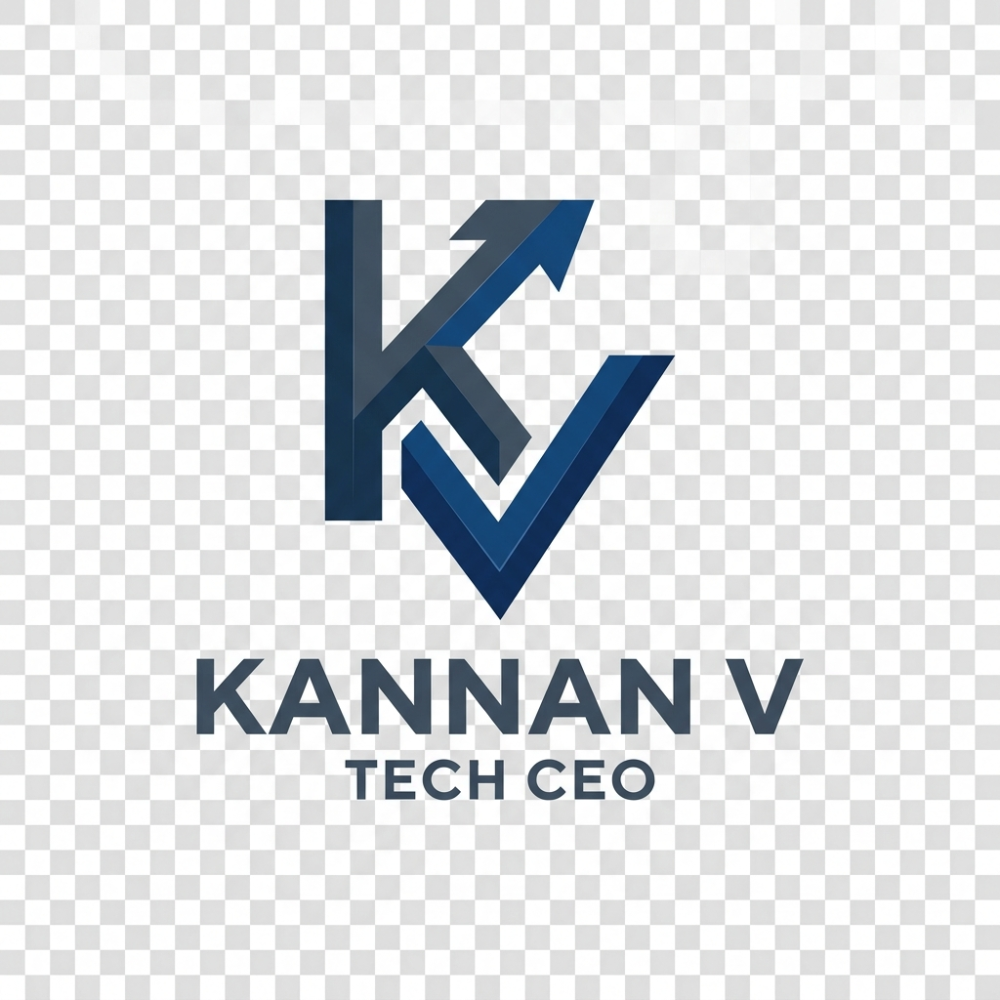

<!-- 
SEO Metadata
Keywords: Kannan V, KannanTech, CEO, Founder, AI Specialist, Full Stack Developer, Software Architecture, Tech Leadership
Description: Professional GitHub profile of Kannan V, Founder & CEO of KannanTech. Specialist in AI, Full Stack Development, and Strategic Tech Innovation.
-->

<header align="center">
  
  <h1 id="kannan-v-ceo">Hi 👋, I'm Kannan V</h1>
  
🚀 <strong>Founder & CEO of <a href="https://www.kannantech.com">KannanTech</a></strong>

  
<em>Architecting Autonomous Intelligence | Full-Stack Innovator | Global Tech Leadership</em>

  

    <a href="https://vkannantech.github.io"><strong>🌐 Visit Official Web Portfolio</strong></a>
  

</header>

<section id="contributions" align="center">
  
</section>

 

<nav align="center">
  
  
</nav>

<article id="executive-dashboard">
  <h2 align="center">🏛️ Executive Management Dashboard</h2>
  

    
    
    
  

</article>

<section id="intelligence-growth">
  <h2 align="center">📊 Intelligence & Performance Metrics</h2>
  

    
    
  

  

    
  

</section>

<section id="expertise-matrix">
  <h2 align="center">🧠 Executive Expertise Matrix</h2>
  

    <table>
      <thead>
        <tr>
          <th>Strategic Mastery</th>
          <th>Architectural Stack</th>
          <th>Intelligence Era</th>
        </tr>
      </thead>
      <tbody>
        <tr>
          <td>🛡️ <strong>Leadership</strong></td>
          <td>⚛️ <strong>Frontend Art</strong></td>
          <td>🤖 <strong>AI / ML</strong></td>
        </tr>
        <tr>
          <td>Project Management</td>
          <td>React / Next.js</td>
          <td>TensorFlow / PyTorch</td>
        </tr>
        <tr>
          <td>Team Scaling</td>
          <td>Node.js / Java</td>
          <td>Computer Vision</td>
        </tr>
        <tr>
          <td>EdTech Innovation</td>
          <td>Cloud / DevOps</td>
          <td>Autonomous Agents</td>
        </tr>
        <tr>
          <td><em>(CEO / Founder Level)</em></td>
          <td><em>(Full Stack Elite)</em></td>
          <td><em>(AI Specialist)</em></td>
        </tr>
      </tbody>
    </table>
  

</section>

<section id="tech-stack">
  <h2 align="center">🛠️ Strategic Tech Architecture</h2>
  

    
  

</section>

<section id="key-initiatives">
  <h2 align="center">🚀 Key Ecosystem Initiatives</h2>
  <ul>
    <li>🏥 <strong><a href="https://github.com/vkannantech/MediCore">MediCore</a></strong>: AI-driven hospital intelligence platform.</li>
    <li>🎵 <strong><a href="https://github.com/vkannantech/Muzi">Muzi</a></strong>: Next-gen music experience engine.</li>
    <li>🎓 <strong><a href="https://github.com/vkannantech/KalviWorld">Kalvi World</a></strong>: Global developer education framework.</li>
  </ul>
</section>

<article id="recent-activity">
  <h2 align="center">⚡ Execution Stream</h2>
  <!--START_SECTION:activity-->
  
<em>Actively building the future... (Live intelligence stream updating soon)</em>

  <!--END_SECTION:activity-->
</article>

<footer align="center">
  

    
    
    
  

   
  
<i>"Technology is the bridge between human imagination and real-world solutions."</i>

  
© 2026 <strong>Kannan V | KannanTech</strong>

</footer>
