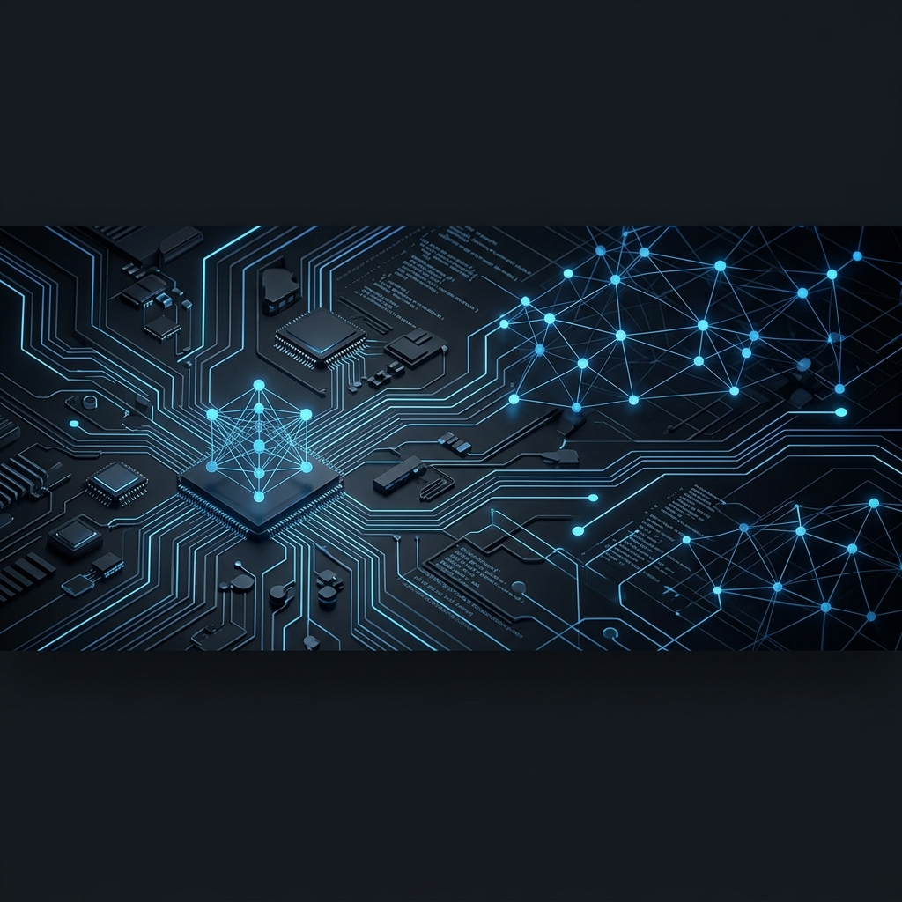

  

<h1 align="center">Hi 👋, I'm Kannan V</h1>
<h3 align="center">🚀 Founder & CEO of <a href="https://www.kannantech.com">KannanTech</a> | Full Stack Developer | AI Specialist</h3>

  💡 <b>Empowering the Next Generation of Developers</b> through practical learning and AI innovation.  
  🤖 Dedicated to building intelligent systems that simplify complexity.  
  🌍 Based in India, impacting globally.

  
  
  

---

### 🏛️ KannanTech Ecosystem

I lead **KannanTech**, a tech-first platform focused on skill acquisition and real-world project development. Our mission is to bridge the gap between education and industry through high-quality internships and AI-driven tools.

- 🌐 **Official Website**: [kannantech.com](https://www.kannantech.com)
- 👨‍💼 **Executive Profile**: [CEO Page](https://www.kannantech.com/ceo)
- 📖 **About the Mission**: [Vision & Story](https://www.kannantech.com/about)
- 🤝 **Hire / Collaborate**: [Inquiry Portal](https://www.kannantech.com/contact)

---

### 📊 GitHub Intelligence

  
  

  

---

### 🧠 Skills & Expertise

| Area | Technologies |
| :--- | :--- |
| **Frontend** |     |
| **Backend** |     |
| **AI & ML** |    |
| **DevOps** |    |

---

### 🚀 Featured Projects

- **[MediCore](https://github.com/vkannantech/MediCore)**: An intelligent hospital management platform built with Java and modern UI.
- **[Muzi](https://github.com/vkannantech/Muzi)**: AI-driven music experience platform.
- **[Kalvi World](https://github.com/vkannantech/KalviWorld)**: The backbone of our developer education system.

---

### ❤️ Support the Progress

If you value the tools and educational content I build at **KannanTech**, please consider becoming a sponsor!

👉 **[Sponsor on GitHub](https://github.com/sponsors/vkannantech)**
👉 **[Direct Donation](https://www.kannantech.com/donate)**

  
⭐ <i>"Coding is not just about building apps; it's about solving real problems for real people."</i> ⭐

  
© 2026 <b>KannanTech</b>. All Rights Reserved.

